# CryptedEye
**Secure**, **User-friendly**, and **offline** vault app, which allows you to create, share and manage vaults. 

A vault consist of passwords and notes. 

You can securely import and export vaults offline, as a vault can be packaged as a single compressed file.

<h1 align="center">

 

</h1>

## Installation
* To install CryptedEye on your phone as the release app, you can get the `.apk` file from [Github](https://github.com/GaecKo/CryptedEye/releases/tag/v1.0.5). 
> [!WARNING]  
> The project is in a WIP stage, latest changes aren't in the apk yet. 

* To work on the app, you need to install [flutter](https://docs.flutter.dev/get-started/install). Once it's done and everything is setup, you simply need to run `flutter run`. 

## App preview
### sign-up
> [!NOTE] 
> Sign-up pages includes a dynamic password quality check.  

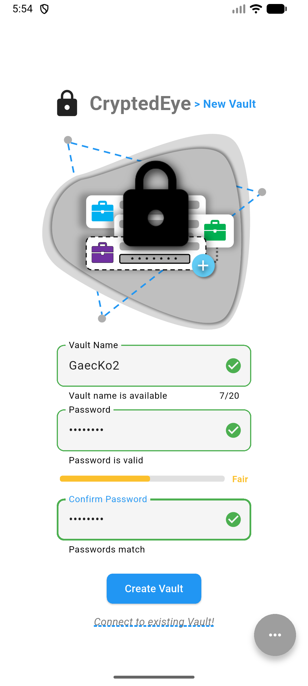

### log-in
> [!NOTE] 
> Login pages allows the selection of the vault, among the multiple you have. 

    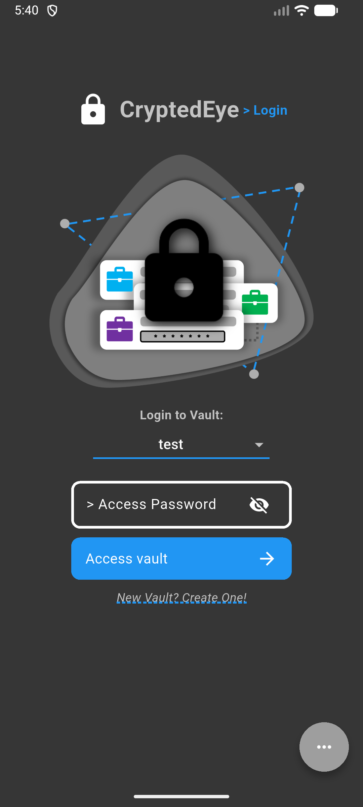
	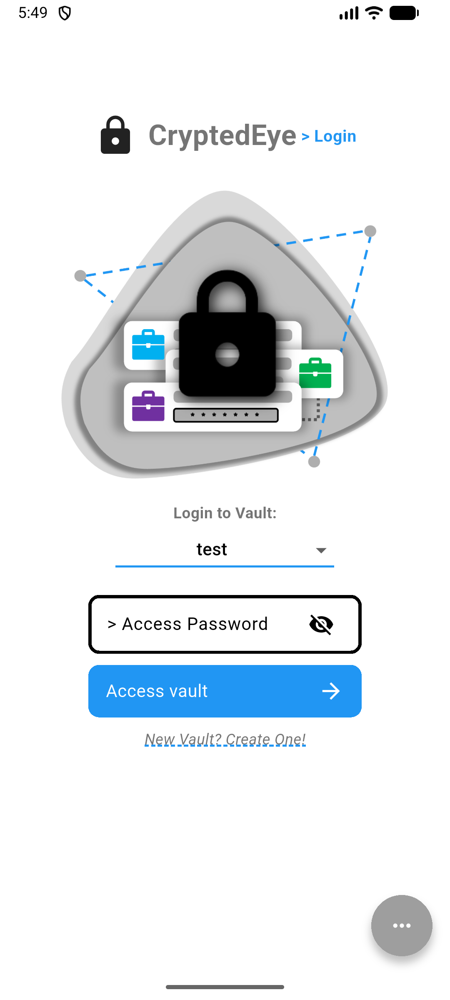

### Passwords page 
> [!NOTE] 
> The password page allows viewing all the passwords, and includes a search bar that you can use for searching any field of a password entry

    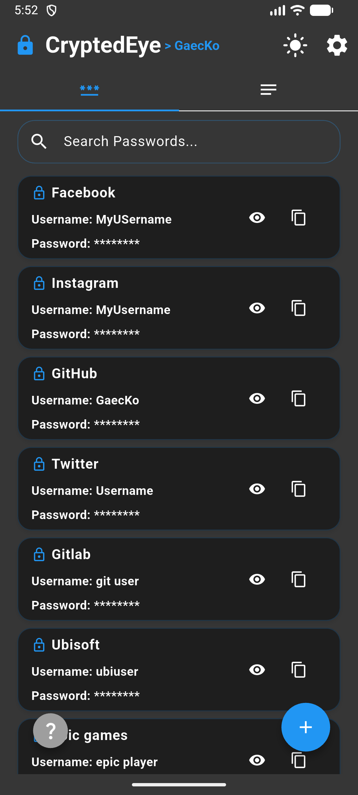
	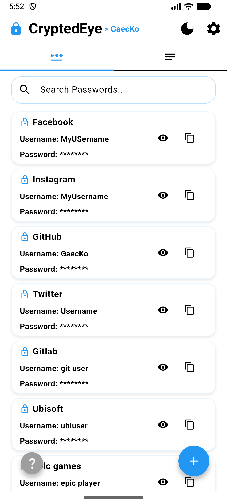

> [!NOTE] 
> Adding a password is as simple as it can get

    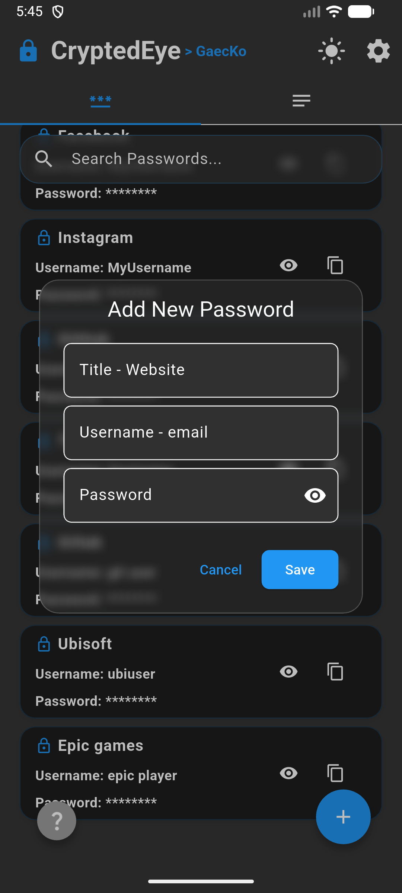
	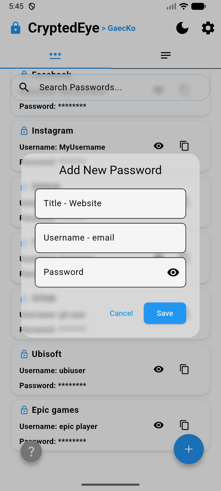

> [!NOTE] 
> Editing and deleting one is also easy

    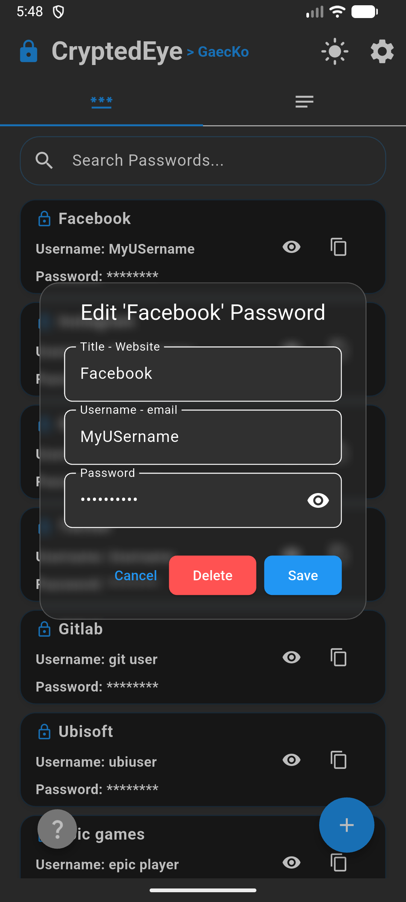
	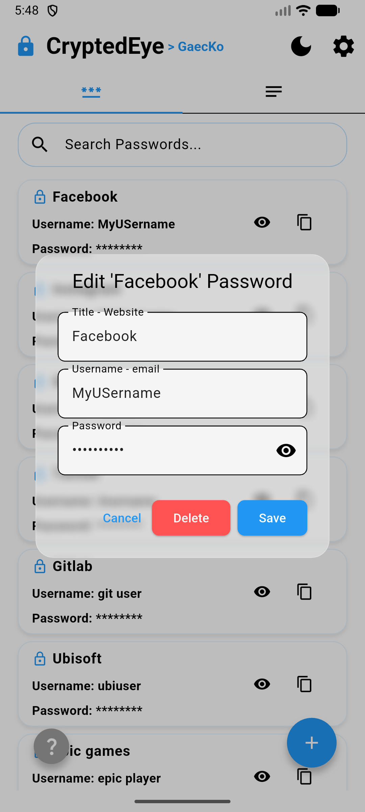

### Notes page

    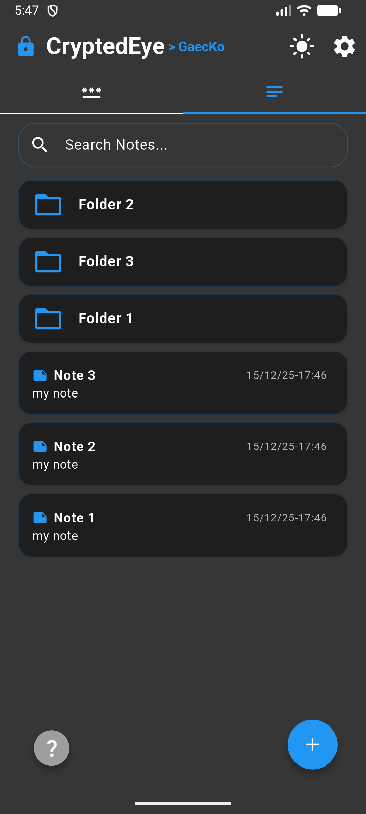
	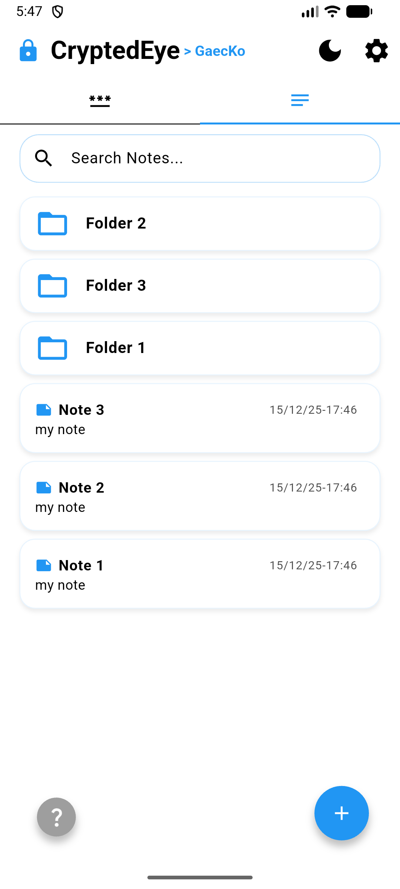

### To document:
This README doens't show the welcome page, as well as note view page, folder page, and setting page. To be done :) 
